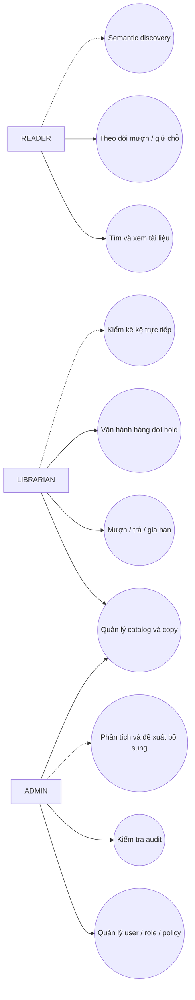

# Use Case Diagram

## Mục đích

Đặt phạm vi hành vi chính theo ba actor. Các use case nét đứt là định hướng nâng cao, chưa hiện thực.

Reader không thực hiện nghiệp vụ quầy; Librarian có quyền vận hành nhưng không tự thay đổi vai trò; Admin chịu cấu hình và giám sát.
