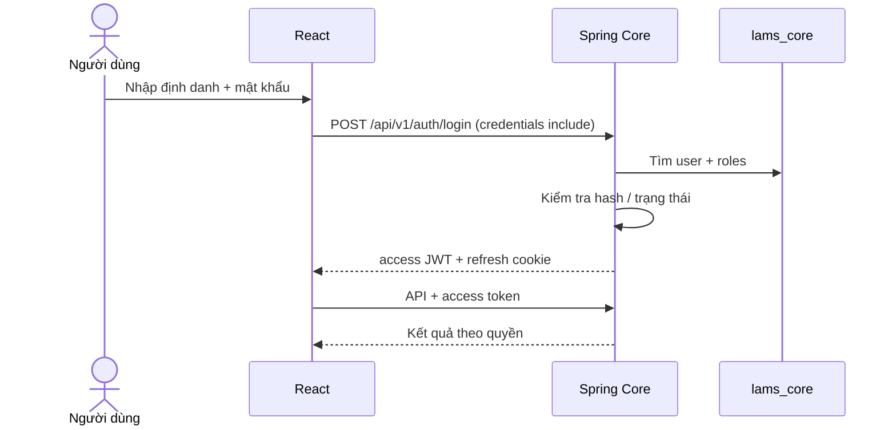
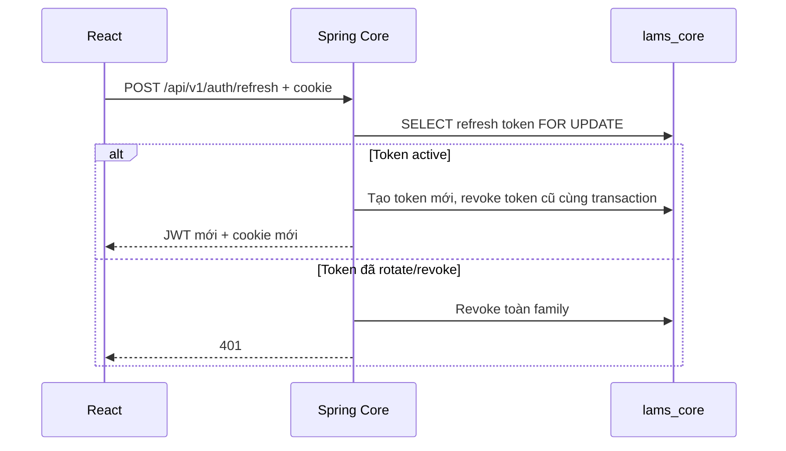
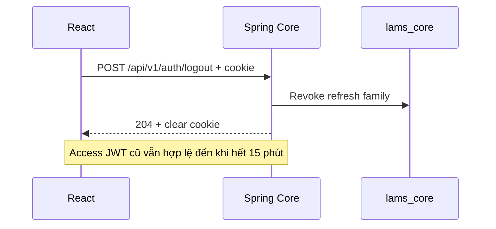
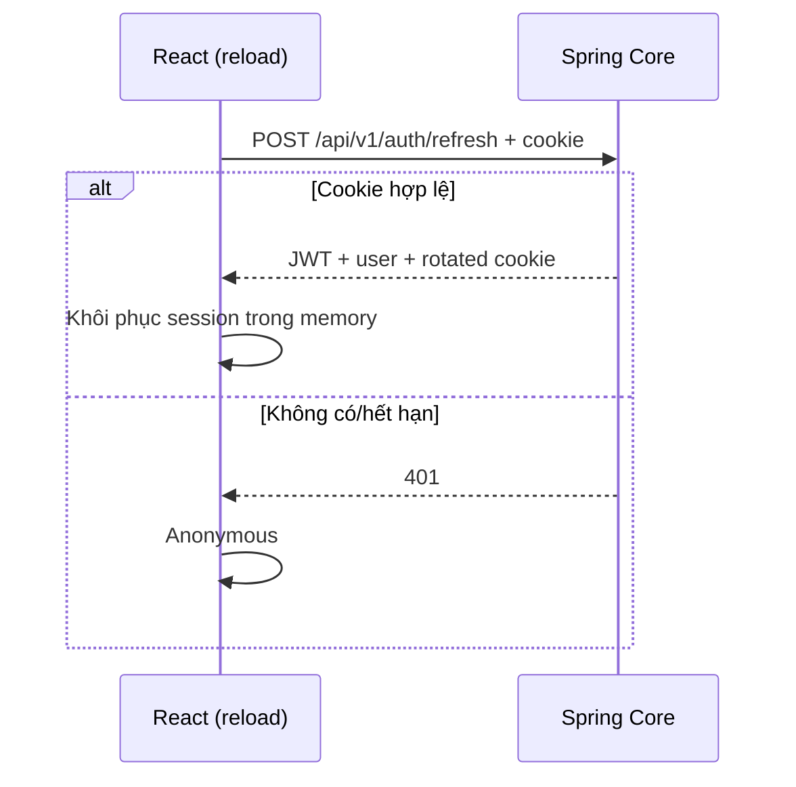

# Authentication Flow — Phase 1A

## Mục đích

Identity nằm trong Spring Core và `lams_core`. Đăng ký chỉ cấp `READER`. Access JWT sống 15 phút trong memory của frontend; opaque refresh token chỉ đi qua cookie `lams_refresh` HttpOnly, SameSite=Lax, path `/api/v1/auth`. PostgreSQL lưu SHA-256 của refresh token. Cấu hình `AUTH_COOKIE_SECURE=true` cho HTTPS production.

Core yêu cầu `LAMS_JWT_SECRET` (ít nhất 32 byte) khi khởi động; `.env.example` chỉ là giá trị mẫu cho local. Không dùng giá trị mẫu khi triển khai production. CORS chỉ cho các origin cấu hình trong `CORS_ALLOWED_ORIGINS`, có hỗ trợ cookie credentials.

Frontend gom các yêu cầu refresh đồng thời vào một promise để tránh reuse do rotation. Server dùng row lock; nếu token đã rotate bị dùng lại, cả family bị thu hồi. Account `LOCKED`/`DISABLED` không được login hoặc refresh. `/auth/me` kiểm tra trạng thái từ DB.
