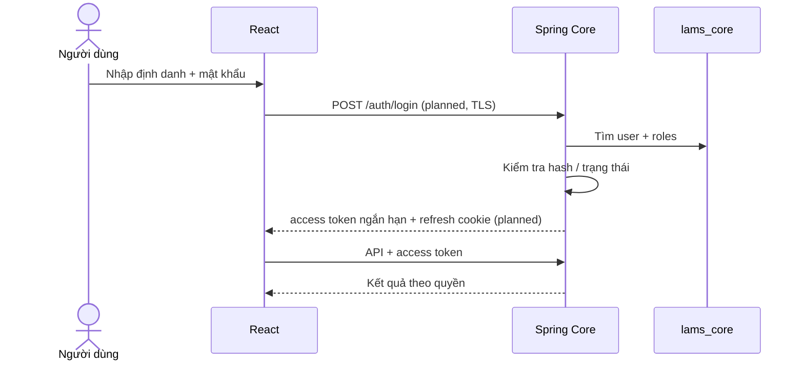

# Authentication Flow Foundation

## Mục đích

Định hướng luồng đăng nhập; starter chỉ có form và security boundary, chưa có token endpoint.

Refresh token nếu dùng phải lưu hash, rotate và revoke. Quyết định cookie/domain/CORS chỉ chốt cùng topology production.
