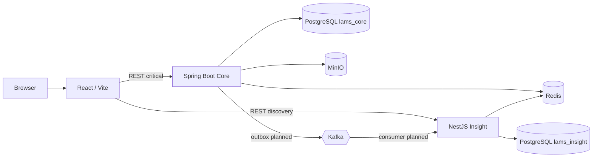

# Container Architecture

## Mục đích

Mô tả trách nhiệm runtime và đường dữ liệu chính.

Core sở hữu transaction nghiệp vụ; Insight không ghi trực tiếp vào `lams_core`. Kafka truyền fact sau commit, không thay transaction đồng bộ.
