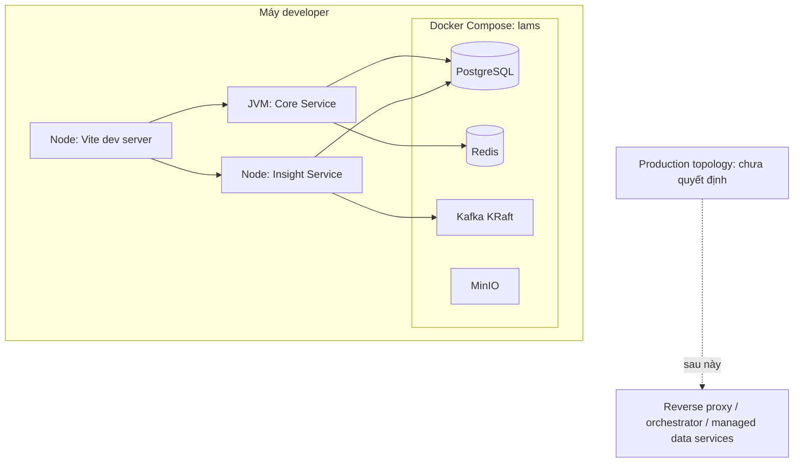

# Deployment Diagram

## Mục đích

Thể hiện topology local hiện tại và hướng production chưa triển khai.

Local dùng hybrid để feedback nhanh. Production cần threat model, backup, HA, secret manager và sizing trước khi chọn nền tảng; sơ đồ không ngụ ý hệ thống đã deploy.
