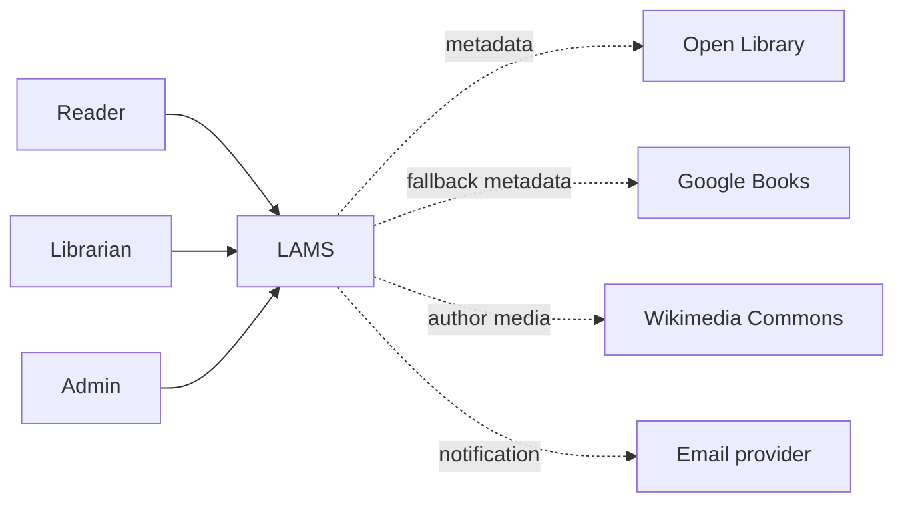

# System Context Diagram

## Mục đích

Cho thấy LAMS và các bên/hệ thống bên ngoài; tích hợp nét đứt là planned.

Ba actor dùng cùng nền tảng với quyền khác nhau. Provider bên ngoài không là source of truth cho circulation; metadata nhập vào phải giữ provenance và có thể được thủ thư xác minh.
