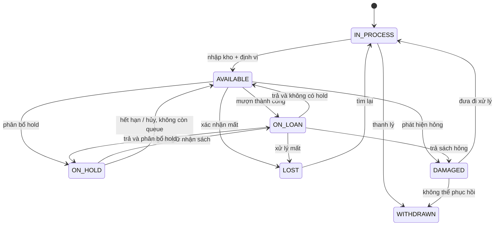

# Copy State Machine

## Mục đích

Chuẩn hóa trạng thái bản vật lý; transition là nghiệp vụ có audit, không phải cập nhật chuỗi tùy ý.

`WITHDRAWN` là terminal theo vận hành thông thường. Mọi transition cần actor/reason/version. `ON_HOLD` phải tham chiếu hold assignment còn hiệu lực; `ON_LOAN` phải có đúng một active loan.
