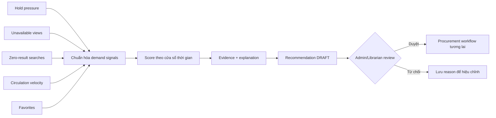

# Workflow đề xuất bổ sung sách

## Mục đích

Tạo đề xuất mua thêm có evidence, không tự động đặt mua.

Score không dùng dữ liệu nhạy cảm cá nhân nếu không cần. Mọi recommendation giữ component score, data window và model/rule version. Ngân sách, số copy đang có, sách đã đặt và mùa vụ là guardrail; con người quyết định cuối.
