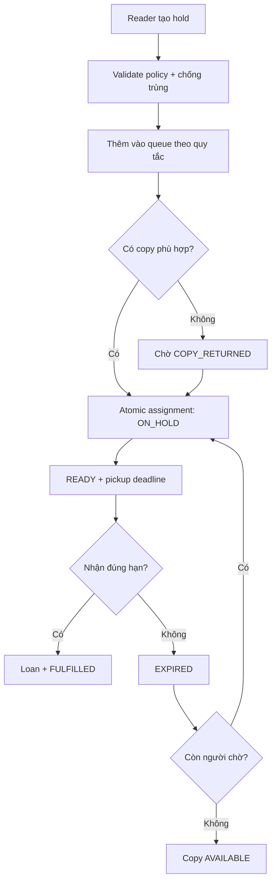

# Smart Hold Workflow

## Mục đích

Mô tả hàng đợi và pickup TTL, chưa phải thuật toán production.

Queue order ban đầu là FIFO có tie-break deterministic; ưu tiên đặc biệt chỉ thêm khi policy được version/audit. Assignment phải compare-and-set copy và hold trong một transaction. Alternative edition chỉ là candidate có sự đồng ý/policy rõ, không tự thay thế ISBN.
