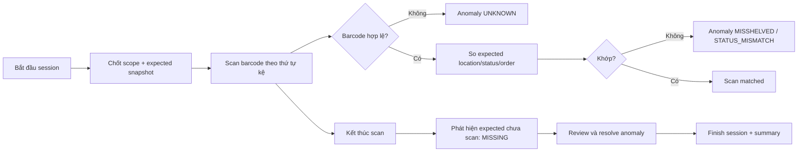

# Workflow kiểm kê kệ sách

## Mục đích

Đối chiếu snapshot mong đợi với scan thực tế mà không làm mất lịch sử.

Scan là append-only trong session; duplicate scan được nhận biết, không tăng số copy. Sửa vị trí/trạng thái là command riêng có quyền và audit, không tự động vì một scan đơn lẻ.
