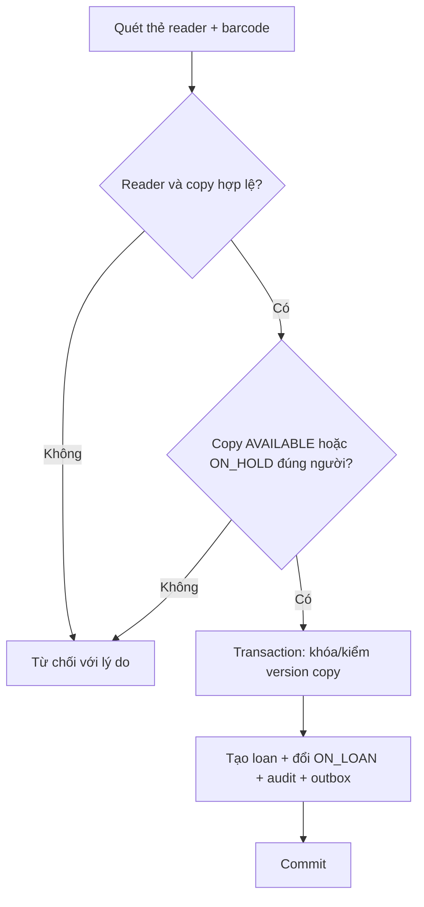

# Workflow mượn và trả

## Mục đích

Đặt transaction boundary để tránh hai người mượn cùng một copy và để hold được phân bổ nhất quán.



### Borrow sequence

```mermaid
sequenceDiagram
  actor L as Librarian
  participant API as Core API
  participant DB as PostgreSQL
  participant O as Outbox publisher
  L->>API: Yêu cầu mượn(copy, reader)
  API->>DB: BEGIN + lock/version check
  API->>DB: INSERT loan; UPDATE copy; audit; outbox
  DB-->>API: COMMIT
  API-->>L: Loan + due date
  O->>DB: Đọc outbox sau commit
  O-->>O: Publish COPY_BORROWED (planned)
```

### Return sequence

```mermaid
sequenceDiagram
  actor L as Librarian
  participant API as Core API
  participant DB as PostgreSQL
  participant H as Hold policy
  L->>API: Trả copy
  API->>DB: BEGIN + lấy active loan/copy
  API->>H: Tìm hold hợp lệ kế tiếp
  alt Có hold
    API->>DB: close loan; copy=ON_HOLD; assign + TTL
  else Không có hold
    API->>DB: close loan; copy=AVAILABLE
  end
  API->>DB: audit + outbox + COMMIT
  API-->>L: Kết quả trả
```

Không gửi Kafka/email bên trong transaction. Publisher/notification xử lý sau commit; retry không được tạo loan/assignment trùng.
