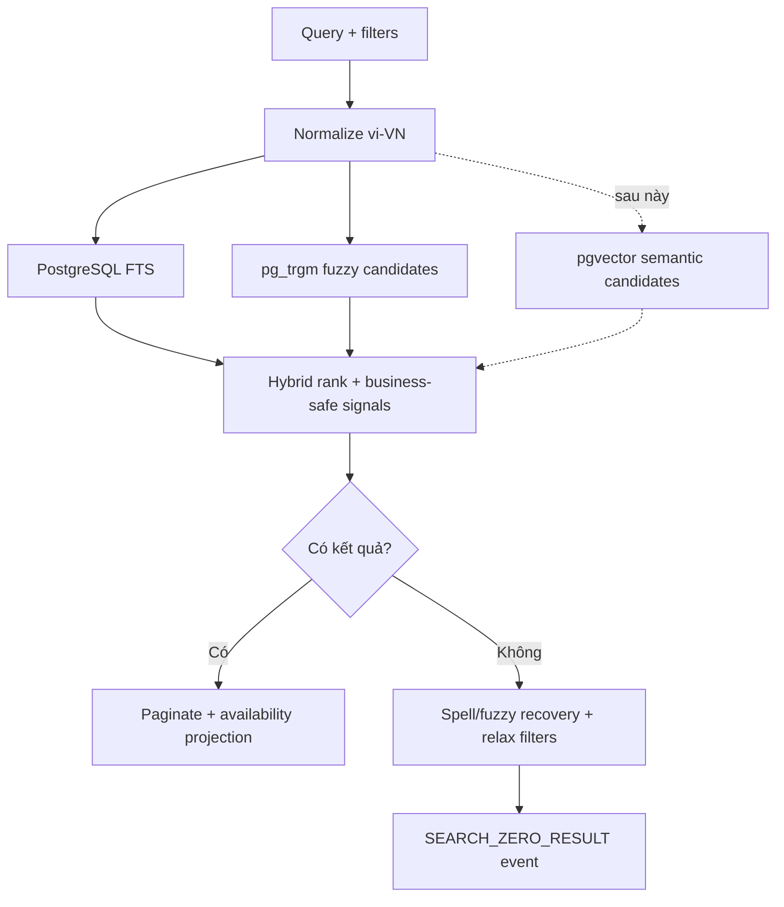

# Workflow Smart Discovery

## Mục đích

Định hướng pipeline tìm kiếm nhiều tầng; Giai đoạn 01 chưa cài extension hay ranking.

Search document là projection, không thay catalog thật. Ranking cần version, offline evaluation và giải thích tối thiểu. `pg_trgm`/`pgvector` chỉ bật bằng migration khi image và benchmark được xác minh; starter không phụ thuộc chúng.
