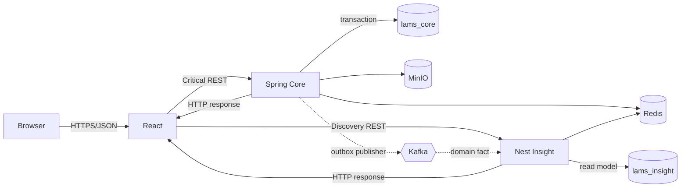
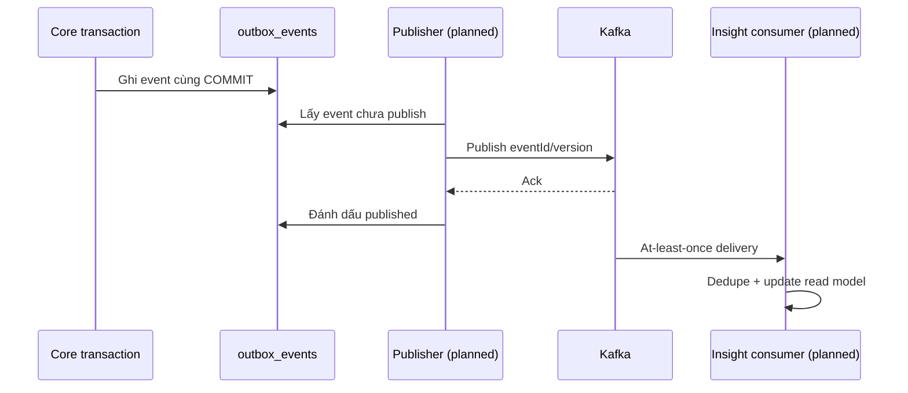

# Tổng quan system flow

## Mục đích

Phân biệt request đồng bộ và event bất đồng bộ planned.

Request ID đi từ browser qua log; correlation ID nối command và event. Redis là tối ưu/coordination, không là source of truth. Nếu Kafka/Insight lỗi, transaction Core đã commit vẫn hợp lệ và outbox sẽ retry.
